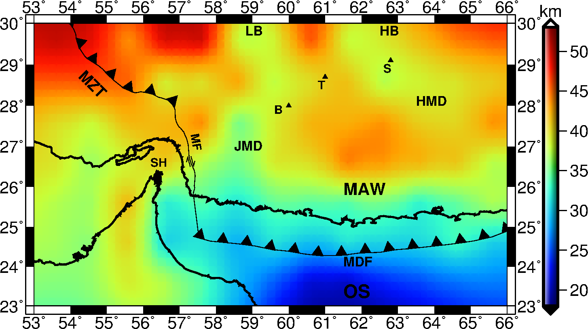

# Moho Beneath the Makran Zone, Iran Based on Gravity Inversion by a Hybrid Metaheuristic

> [Sanam Hosseinzadeh](https://scholar.google.com/citations?user=QMqrtgsAAAAJ&hl=en&oi=ao)  
> [Gökhan Göktürkler](https://scholar.google.com/citations?user=IRlRnZgAAAAJ&hl=en)  
> [Seçil Turan-Karaoğlan](https://scholar.google.com/citations?user=mvZ-EpQAAAAJ&hl=en)  
> [Somayeh Abdollahi](https://scholar.google.com/citations?user=HoX5-mgAAAAJ&hl=en&oi=ao)  
---
## Key Points:
-	We recovered the Moho depth map beneath the Makran Subduction Zone using gravity data from satellite sources
-	Moho depths range from 19 km in the Oman Sea to 45 km beneath the Taftan-Bazman volcanic arc
-	Our estimated Moho depths align with the tectonic framework of the Makran region and closely match previous Moho models
---
## Abstract

The Makran Subduction Zone (MSZ) has sparse seismic activity, limited accessibility, and insufficient seismic coverage, making traditional seismic methods less effective for estimating Moho depth. 
As a result, alternative approaches like gravity inversion are essential for Moho modeling in this region. This study utilizes gravity anomalies to model the Moho depth, employing a hybrid inversion
method that combines Differential Evolution (DE) and Particle Swarm Optimization (PSO). This approach is suitable for solving high-dimensional and complex gravity inverse problems,ensuring both accuracy
and computational efficiency. In the forward modeling, Bouguer gravity anomalies are attributed to an anomalous mass with a constant density between a flat reference Moho and the undulating Moho surface.
Rectangular prisms in a Cartesian framework are employed to compute the gravitational field of this mass. Validation on synthetic data shows that the method effectively recovers smoothly changing Moho 
topographies. Application of the algorithm to the Makran region, using satellite-derived Bouguer anomalies, reveals the Moho depths:  19–30 km beneath the Oman Sea, 30–40 km in the Makran fore-arc, and 
40–45 km over the Taftan-Bazman volcanic arc.

---

## Gravitational Forward Modeling
The forward modeling is based on rectangular prism formulations as described by [Snopek and Casten (2006)](https://doi.org/10.1016/j.cageo.2005.08.008) and [Prutkin and Saleh (2009)](https://doi.org/10.1016/j.jog.2008.12.001).

---

## Method: DE/PSO Hybrid Algorithm
The hybrid approach employed in the present study is called DE/PSO and combines DE and PSO algorithms. Further details on the hybrid algorithm can be found in [Hosseinzadeh et al. (2023)](https://doi.org/10.1007/s40328-023-00414-x).

---



>The estimated Moho depth for Makran, Iran using satellite-based gravity data. The main structures are labeled as follows: Main Zagros Thrust (MZT), Minab Fault (MF), Makran Accretionary Wedge (MAW), Makran Deformation Front (MDF), Oman Sea (OS), Strait of Hormuz (SH), Jaz Murian Depression (JMD), Hamun-Mashkel Depression (HMD), Bazman (B), Taftan (T), Sultan (S), Lut Block (LB), Helmand Block (HB).

---
## Repository Contents

This repository is organized into four main folders:

- `CRUST1_synthetic_data/` (Section *Simple Synthetic Data*)
- `simple_synthetic_data/`(Section *CRUST1.0 Synthetic Data*)
- `Makran_satellite_based_data/` (Section *Moho Depth in the Makran Zone, SE Iran*)
- `study_area_map_GMT_scripts/` map of the study area, Makran, SE Iran (Figure 1).

Each folder includes relevant subfolders, data, scripts, and a README file that describes its structure and usage.

---

## Setting up your environment
### R Programming Language

This work uses **R version 4.2.0** (released April 2022).
To run the analysis, first set up the R environment and install the necessary packages. Follow the steps below to get started.

### 1. Install R

If you don't have R installed, download and install the latest version of R from the official website:  
[https://cran.r-project.org/](https://cran.r-project.org/)

### 2. Install Required R Packages

The "NMOF" and "logr" packages should be installed. To install these packages, open R or RStudio and run the following commands:

```r
install.packages("NMOF")
install.packages("logr")
```
To ensure the necessary R packages are installed and functioning, run the following commands to load the package:

```r
library(NMOF)
library(logr)
```
If the package is not installed or there is an issue loading it, R will display an error message.

### GMT For Mapping

This work also uses **Generic Mapping Tools (GMT)** ([Wessel and Smith, 1995](https://doi.org/10.1029/95EO00198)) for plotting the study area and gravity anomaly maps.  
If you plan to run the GMT scripts, make sure that GMT is correctly set up in your system's `PATH` so that the script can access it.

**Download and install GMT from the official site:**  
[https://www.generic-mapping-tools.org/download/]


### Citations

- R Core Team (2022). *R: A Language and Environment for Statistical Computing*. R Foundation for Statistical Computing, Vienna, Austria. [https://www.R-project.org/](https://www.R-project.org/)

- Gilli, M., Maringer, D., & Schumann, E. (2019). *Numerical Methods and Optimization in Finance*. Academic Press. [https://CRAN.R-project.org/package=NMOF](https://CRAN.R-project.org/package=NMOF)

- Bosak, D. (2022). *logr: Creates Log Files*. R package version 1.3.2. [https://CRAN.R-project.org/package=logr](https://CRAN.R-project.org/package=logr)

---

##  License
The source code is released under the MIT License, allowing you to freely use, modify, and distribute the code. Attribution to the original authors must be provided. For complete license details, refer to the `LICENSE.md` file.

The manuscript is ready for submission and will be open to modifications and revisions as part of the submission process.
